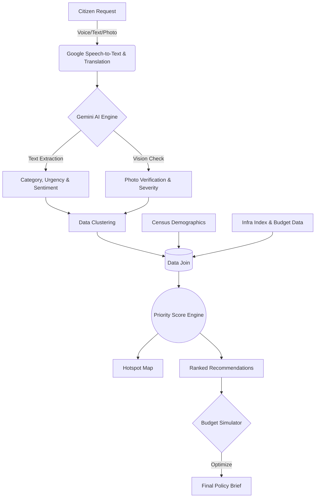
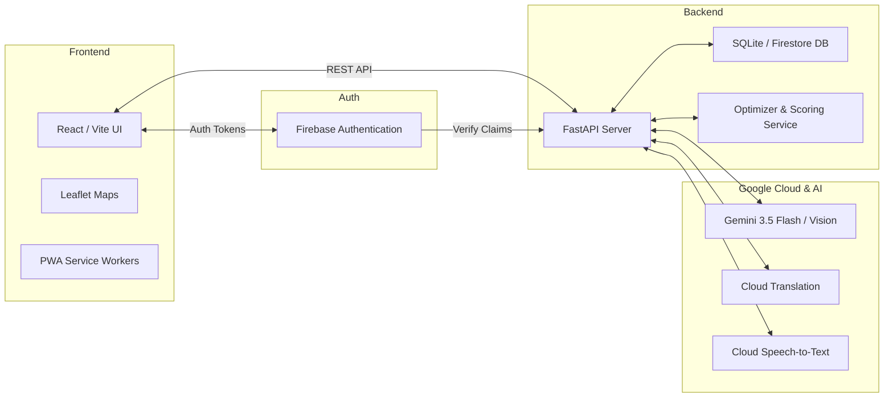

<h1 align="center">JanSetu 🌉</h1>

<p align="center"><strong>AI for Digital Public Infrastructure & Governance — Bridging the Gap Between Citizens and Policymakers</strong></p>

<p align="center">
  
  
  
  
  
  
  
  
  
  
</p>

<p align="center">
  <a href="<LIVE_DEMO_URL>">Live Demo</a> •
  <a href="<DEMO_VIDEO_URL>">Demo Video</a> •
  <a href="<PITCH_DECK_URL>">Pitch Deck</a>
</p>

> *"Government funds are limited, but civic needs are infinite. JanSetu replaces reactive complaint boxes with proactive, data-driven AI prioritization."*

---

## Table of Contents
- [The Problem & Our Solution](#the-problem--our-solution)
- [Key Features](#key-features)
- [Screenshots Gallery](#screenshots-gallery)
- [How It Works](#how-it-works)
- [System Architecture](#system-architecture)
- [The Priority Score](#the-priority-score)
- [Data Sources](#data-sources)
- [Tech Stack](#tech-stack)
- [Project Structure](#project-structure)
- [Getting Started](#getting-started)
- [API Overview](#api-overview)
- [AI Prompts and Guardrails](#ai-prompts-and-guardrails)
- [Privacy and Responsible AI](#privacy-and-responsible-ai)
- [Scaling Across India](#scaling-across-india)
- [Roadmap](#roadmap)
- [Team](#team)
- [License](#license)

---

## The Problem & Our Solution

**The Problem:**
- Traditional grievance portals are text-heavy, alienating illiterate or non-English/Hindi speaking citizens.
- Civic complaints arrive as unstructured noise, requiring manual sorting by municipal officers.
- Policymakers lack a data-driven way to decide *which* broken road or water leak to fix first when budgets are constrained.

**Our Solution:**
JanSetu is a multilingual AI platform that democratizes civic participation and optimizes government spending. Citizens raise requests via voice, text, or photo in their native language. JanSetu uses Google's Gemini AI to extract urgency, sentiment, and categorize the issue. The platform then mathematically joins these real-time citizen demands with demographic data and infrastructure indices to generate an **Explainable Priority Score** and run **Budget Simulations** for policymakers.

---

## Key Features

### 👨‍👩‍👧‍👦 For Citizens
- **Multilingual Input**: Raise requests in English, Hindi, or Tamil (with 9 languages supported).
- **Voice & Photo First**: Speak directly into the app or upload photos.
- **Real-Time Tracking**: Timeline updates on the status of their civic requests.

### 🏛️ For Policymakers
- **Demand Hotspot Mapping**: Heatmaps of clustered civic issues down to the block level.
- **Infrastructure Need-Gap Analysis**: Compares citizen demand against actual historical spending and census infrastructure indices.
- **AI-Powered Recommendations**: Automatically ranks projects based on a mathematical priority score.
- **🤖 AI Photo Verification (Differentiator)**: Gemini Vision assesses uploaded photos to confirm they match the claimed category and gauges hazard severity.
- **💰 Budget Simulator (Differentiator)**: Input a strict financial budget (e.g., ₹50 Lakh) and let the AI Optimizer select the exact combination of projects that maximizes the number of citizens served.
- **Automated Policy Briefs**: Generates PDF summaries for rapid executive review.

---

## Screenshots Gallery

| Citizen Experience | Policymaker Dashboard |
|:---:|:---:|
| <br>*OTP-based Authentication* | <br>*Analytics & Hotspot Mapping* |
| <br>*Voice & Photo Issue Reporting* | <br>*Infra Gap Analysis* |
| <br>*Request Tracking & Timeline* | <br>*AI Recommendations & Simulator* |

---

## How It Works



---

## System Architecture



*For more details, see [ARCHITECTURE.md](docs/ARCHITECTURE.md).*

---

## The Priority Score

JanSetu does not rely on subjective guessing. We use a transparent mathematical model to rank civic needs.

### 1. Priority Score Formula
Found in `services/scoring.py`:
```python
volume_norm = log10(request_count + 1)
urgency_multiplier = 1.0 + (urgency_avg / 5.0)
photo_severity_multiplier = 1.0 + (photo_severity_avg / 5.0)
infra_factor = max(0.1, 1.0 - infra_index)
pop_weight = 1.0 + min((pop / 500000) * 0.5, 0.5) + min((vul_pop / max(pop, 1)), 0.5)

priority = volume_norm * urgency_multiplier * photo_severity_multiplier * infra_factor * pop_weight
final_score = 1.0 - (1.0 / (1.0 + priority))  # Squashed to 0-1
```

### 2. Infra Gap Score Formula
Found in `services/analytics_engine.py`:
```python
gap_score = demand_per_lakh * (1 - infra_idx) * (1 - spend_ratio)
```
*Example:* A district with 500 water complaints per 100k people, a low existing water infra index (0.3), and historically low spending ratio (0.2) yields an extreme gap score of `500 * 0.7 * 0.8 = 280`, immediately flagging it to policymakers.

---

## Data Sources

| Dataset Name | Provides | Status |
|---|---|---|
| `demographics.csv` | Population, vulnerable groups per district/block | 🟢 **Real** (2011 Census - TN & Bihar) |
| `infra_index.csv` | Electricity access index | 🟢 **Real** (2011 Census) |
| `infra_index.csv` | Water, roads, health, sanitation index | 🟡 **Sample** (Synthetic distribution) |
| `public_investment.csv` | Budget allocations and historical spend | 🟡 **Sample** (Synthetic realistic scale) |

---

## Tech Stack

| Layer | Technology | Purpose |
|---|---|---|
| **Frontend** | React 19, TypeScript, Vite, TailwindCSS | High-performance, responsive UI |
| **Maps** | Leaflet, react-leaflet | Geographic hotspot rendering |
| **Backend** | Python 3, FastAPI, Uvicorn | Async REST API and data pipeline |
| **Database** | SQLite (Local fallback) / Firestore | Storing user requests and analytics |
| **Optimization** | PuLP | Linear programming for Budget Simulator |
| **Google Tech** | **Gemini 3.5 API**, **Firebase Auth**, **Google Cloud Speech**, **Cloud Translation** | Core AI extraction, vision verification, and identity management |

---

## Project Structure

```text
JanSetu/
├── backend/                  # FastAPI Application
│   ├── app/
│   │   ├── api/              # REST API Routers
│   │   ├── data/             # CSV Datasets & SQLite DB
│   │   ├── models/           # Pydantic Schemas & Enums
│   │   └── services/         # Gemini, Scoring, Optimizer logic
│   └── requirements.txt      # Python dependencies
├── frontend/                 # React Application
│   ├── src/
│   │   ├── components/       # Reusable UI components & Layouts
│   │   ├── lib/              # API clients and Firebase config
│   │   ├── locales/          # i18n JSON translation files (en, hi, ta)
│   │   └── pages/            # View pages (Login, Citizen, Admin, Officer)
│   └── package.json          # Node dependencies
└── docs/                     # API Contracts and Architecture
```

---

## Getting Started

### Prerequisites
- Node.js (v18+)
- Python (3.10+)
- Firebase Project (with Authentication enabled)
- Google Gemini API Key

### 1. Environment Setup

Copy the example environment files and fill them in:

**Backend (`backend/.env`)**
| Variable | Where to get it | Required? |
|---|---|---|
| `GEMINI_API_KEY` | Google AI Studio | Yes |
| `DEV_MODE` | Set to `True` for local SQLite | Yes |
| `FIREBASE_CREDENTIALS_PATH` | Firebase Service Account JSON | No (if DEV_MODE=True) |

**Frontend (`frontend/.env`)**
| Variable | Where to get it | Required? |
|---|---|---|
| `VITE_API_BASE_URL` | Default: `http://localhost:8000/api/v1` | Yes |
| `VITE_FIREBASE_API_KEY` | Firebase Console -> Project Settings | Yes |
| `VITE_FIREBASE_AUTH_DOMAIN` | Firebase Console | Yes |
| `VITE_USE_MOCKS` | Set to `false` to connect to backend | Yes |

### 2. Run Locally

<details open>
<summary><b>Windows (PowerShell)</b></summary>

```powershell
# 1. Start Backend
cd backend
python -m venv .venv
.\.venv\Scripts\Activate.ps1
pip install -r requirements.txt
python -m uvicorn app.main:app --reload

# 2. Start Frontend (in a new terminal)
cd frontend
npm install
npm run dev
```
</details>

<details>
<summary><b>macOS / Linux</b></summary>

```bash
# 1. Start Backend
cd backend
python3 -m venv .venv
source .venv/bin/activate
pip install -r requirements.txt
python -m uvicorn app.main:app --reload

# 2. Start Frontend (in a new terminal)
cd frontend
npm install
npm run dev
```
</details>

### Default URLs & Testing
- **Frontend App**: `http://localhost:5173`
- **Backend Swagger API Docs**: `http://localhost:8000/docs`
- **Test Login**: In Dev Mode, use the mock login buttons on the login page (Citizen or Officer) to bypass Firebase OTP for rapid testing.

---

## API Overview

| Method | Path | Role | Description |
|---|---|---|---|
| `POST` | `/auth/session` | Any | Verifies Firebase token and initializes session |
| `POST` | `/requests` | Citizen | Submit a new text/voice/photo request |
| `GET`  | `/requests/mine` | Citizen | Fetch logged-in user's requests |
| `GET`  | `/analytics/summary` | Officer | Topline stats and category breakdowns |
| `GET`  | `/analytics/hotspots`| Officer | Geolocation clusters of civic issues |
| `GET`  | `/analytics/gaps` | Officer | Infra gaps based on demand vs spending |
| `GET`  | `/recommendations` | Officer | AI-ranked projects based on Priority Score |
| `POST` | `/simulator/run` | Officer | Runs the linear-programming Budget Simulator |

*Read the full [API Contract](docs/api-contract.md) for payload schemas.*

---

## AI Prompts and Guardrails

JanSetu utilizes **Gemini 3.5 Flash** for rapid, accurate extraction of civic data.
- **Strict JSON Validation**: The LLM is prompted to return strict, markdown-free JSON. Pydantic schemas enforce type-safety on the backend.
- **Fallback Guardrails**: If extraction fails or a category is hallucinatory, the system automatically falls back to the `other` category to ensure no citizen request is ever dropped.
- **Vision Verification**: The Vision prompt in `gemini_vision.py` assesses if an uploaded photo matches the claimed category (e.g., verifying a pothole photo matches a "roads" complaint). **Crucially**, a mismatch does not auto-reject the claim (defaulting to `matches_request: True` on failure) to prevent penalizing users for poor lighting or bad angles.

---

## Privacy and Responsible AI

- **Data Minimization**: We do not collect Aadhaar, religion, or caste details.
- **Aggregation for Privacy**: Policymaker dashboards aggregate data to the District and Block levels, anonymizing individual citizen PII.
- **Human-in-the-Loop (HITL)**: The AI does not unilaterally reject requests or allocate budgets. It provides *Explainable AI* justifications for its priority scores, which officers can override via the `/clusters/{id}` correction endpoint.

---

## Scaling Across India

JanSetu is designed hierarchically: `State -> District -> Block`.
Onboarding a new state simply requires appending their demographic and infrastructure data to the respective CSV datasets. The UI architecture natively supports 9 Indian languages via `react-i18next`, making the system immediately deployable across state lines. The REST API is designed to easily plug into existing state grievance portals (e.g., CM Helpline).

---

## Roadmap

1. **Cloud Production Deployment**: Containerize and deploy via Google Cloud Run with BigQuery for massive analytical queries.
2. **Native Telephony Integration**: Connect to IVR systems so citizens can simply dial a toll-free number without needing a smartphone.
3. **WhatsApp / SMS Bot**: Deploy a conversational chatbot channel for requests.
4. **Real Government Scheme APIs**: Integrate live APIs from actual government fund trackers instead of CSVs.
5. **Offline PWA Capabilities**: Allow field officers and rural citizens to cache maps and submit reports offline.

---

## Team

| Name | Role | GitHub |
|---|---|---|
| **Aisha Amna A** | Backend, AI Pipelines & Analytics | [@aishaamna9b-art](https://github.com/aishaamna9b-art) |
| **Avanthiga E** | Frontend & UI/UX | [@<AVANTHIGA_GITHUB_URL>](https://github.com/avanthiga0630) |

---

*Built with care for Code for Communities.*
