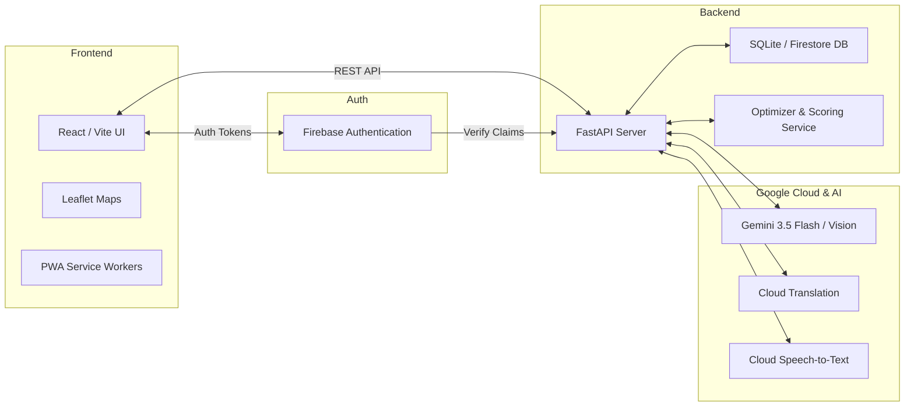
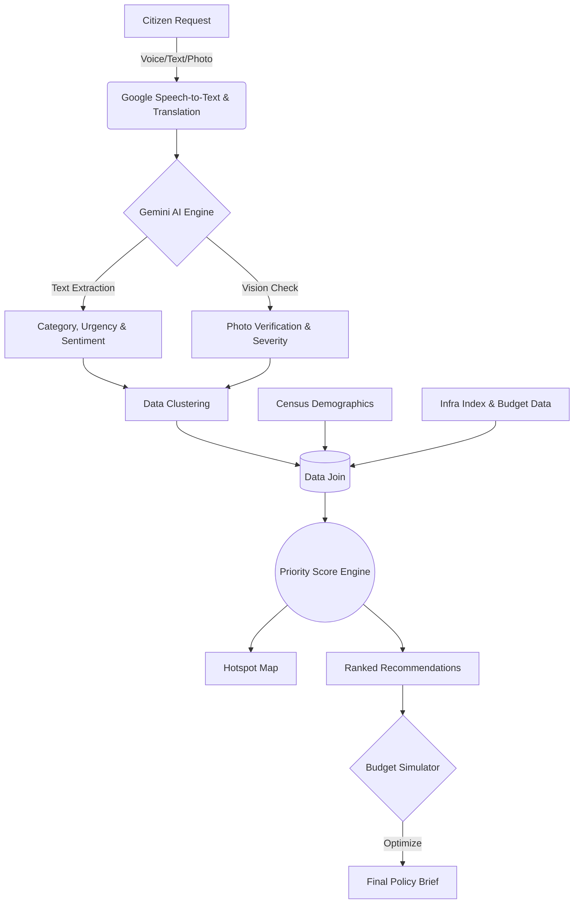

# JanSetu Architecture

This document outlines the detailed system architecture and data lifecycle for JanSetu.

## 1. High-Level Architecture

JanSetu employs a modern decoupled architecture, combining a React/Vite progressive web app on the frontend with a robust FastAPI backend. Core intelligence is powered by Google Gemini APIs.

### Components:
- **Frontend App**: Responsive React UI tailored for mobile-first citizen reporting and desktop-optimized dashboards for policymakers. Uses Leaflet for heatmaps.
- **Identity Layer**: Firebase handles OTP-based authentication for citizens and OAuth/Email for officers, returning JWTs verified by FastAPI.
- **FastAPI Core**: Handles routing, data persistence, and acts as an orchestration layer for AI tasks.
- **AI Engine (Gemini)**: Extracts structured data from raw unstructured citizen complaints and visually verifies reported issues.
- **Scoring & Optimization Engine**: Math-based models utilizing Pandas and PuLP for priority scoring and budget simulations.

---

## 2. The Request Lifecycle (Citizen to Recommendation)

Every time a citizen reports an issue, JanSetu processes the request through a multi-stage data pipeline to convert unstructured noise into actionable policy recommendations.

### Step-by-Step Breakdown:

1. **Intake**: A citizen uploads a photo, records an audio clip, or types a message in their local language.
2. **Translation & Speech-to-Text**: If audio is provided, it's transcribed. The text is translated to English for unified backend processing, while retaining the original language text for the citizen's UI.
3. **LLM Extraction**: `gemini_extract.py` prompts Gemini 3.5 to parse the text into a strict JSON schema determining the civic `category` (e.g. water, roads), specific `sub_issue`, `urgency` (1-5), and `sentiment`.
4. **Vision Verification**: If a photo is attached, `gemini_vision.py` cross-checks the image against the claimed category to gauge severity and detect spam.
5. **Clustering**: Requests are geographically and categorically clustered to identify "hotspots" rather than treating every complaint in isolation.
6. **Data Joining**: The clustered demand is merged with:
   - **Demographics**: Total population and vulnerable population for the block.
   - **Infra Index**: Existing infrastructure scores from Census datasets.
7. **Scoring**: `scoring.py` computes a mathematical priority score based on complaint volume, urgency, severity, infra deficit, and population density.
8. **Action**: 
   - Hotspots appear on the officer's Leaflet map.
   - High-priority clusters surface as AI Recommendations.
   - The Budget Simulator (`optimizer.py` using PuLP) mathematically selects the optimal combination of projects to resolve given a strict financial constraint.
